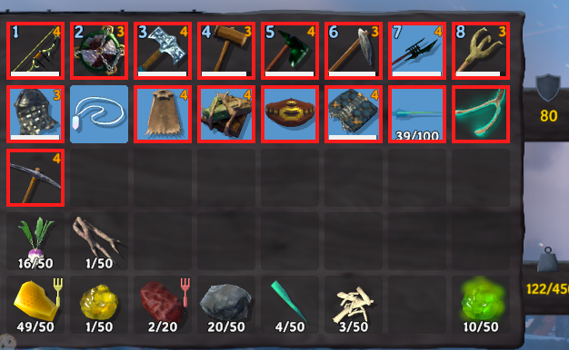

# Visual Impairment Support

I made this mod for a friend of mine who plays Valheim and has significant vision impairment due to the loss of part of his optic nerve.

## Features

### Important Item Highlight
The mod adds a red outline to inventory slots containing weapons, armor, or tools. Shields, utility items, and ammunition are highlighted as well. Other items are left unoutlined. This is a visual change only; it does not affect item behavior or properties. The outlines make it easier to spot which items in his inventory are important and worth keeping.

### Item type and quantity announcer
Click the middle mouse button (M3) over an item in the player inventory or a container to hear its localized name and stack count using Windows text-to-speech. The voice, speed, volume, M3 toggle, and spoken text format can be configured in the BepInEx configuration file. The optional total-count format includes matching items in that inventory or container.

The voice feature uses the bundled `ItemAnnouncer.Speaker.exe` helper and Windows Speech. Keep the helper next to `VisualImpairmentSupport.dll` in the plugin folder.

## Inventory

If you also have a visual impairment and would like additional accessibility features, I am open to hearing your ideas and considering new features for the mod.

## Credits

Thank you Shadow for the the code for the item announcer.